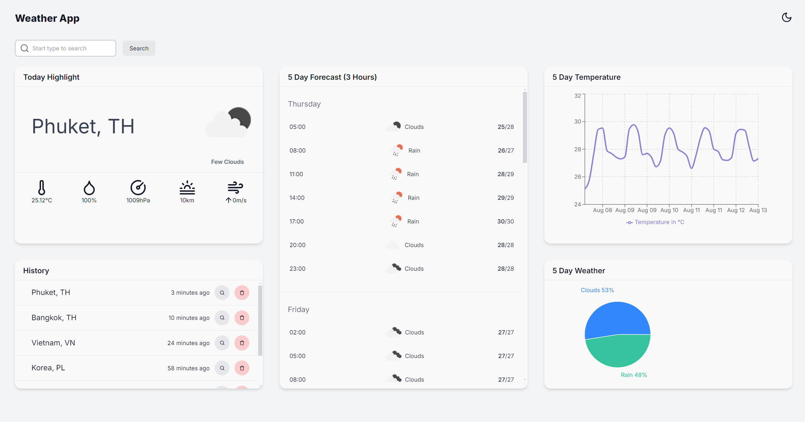

Live Demo: https://weather-app-theta-sepia-20.vercel.app/
# Weather App

Weather App is a web application that provides users with current weather conditions and a 5-day forecast in 3-hour intervals. The application features a dashboard where users can search for a city's weather, view detailed information, see graphical representations of weather trends, and access their search history.

## Features

- **Current Weather**: Get the latest weather information for any city, including temperature, humidity, wind speed, and more.
- **5-Day Forecast**: View weather predictions for the next 5 days, updated every 3 hours.
- **Charts**: Visualize weather data with interactive charts.
- **Search History**: Keep track of previously searched cities and quickly access their weather information.
- **Dark/Light Mode Toggle**: Switch between dark and light modes for better readability and user preference.


## Technologies Used

- **Frontend**: `React`, `NextJS`, `TypeScript`
- **Styling**: `Tailwind CSS`
- **APIs**: `OpenWeatherMap API`
- **Charting**: `recharts`
- **Icon**: `lucide-react`
- **State Management**: `Redux`
- **Component Library**: `Material UI`

## Getting Started
### Prerequisites
- Node.js 18.17 or later. 

*I'm using Node.j v20.15.0, npm v10.7.0*
### Installation
1. Clone the repository:
```
git clone https://github.com/hoeloon/weather-app.git
```
2. Navigate to the project directory:
```
cd weather-app
```
3. Install the dependencies:
```
npm install
```
### API Key Setup
1. Sign up for an API key from OpenWeatherMap.
2. Create a `.env.local` file in the root directory of the project and add your API key:
```bash
NEXT_PUBLIC_OPEN_WEATHER_API_KEY=your_api_key_here
```
### Running the Application
1. Start the development server:
```
npm run dev
```
2. Open your browser and navigate to http://localhost:3000 to view the application.

## Usage
1. Enter a location in the search bar to retrieve current weather data and a 5-day forecast.
2. View weather information and forecasts in a user-friendly format.
3. Switch between dark and light modes using the toggle button in the navigation bar.
4. Access your previous searches from the search history section.

## Screenshots
*More screen can be found in `/screenshots` folder*


*Description: A screenshot of the main dashboard showing current weather and forecast charts.*


*Description: A screenshot of the main dashboard in dark mode*
